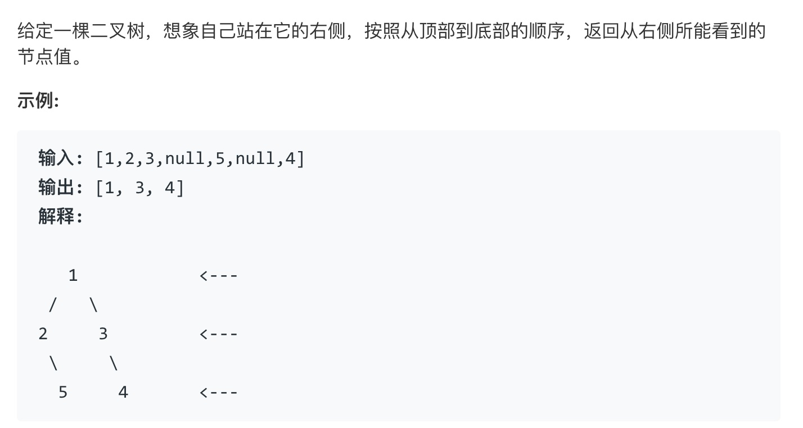

### 最近在一直在刷LeetCode, 一直在练习DFS与BFS的题，练多了发现有很多都是有固定套路的心得：

<!-- more -->

> 先写一段伪代码，这段伪代码是下面套路的“白话文”

```swift 
// 1. 这里的value 是初始值
func start(value) {
    // 2. 初始值的边界问题
    if (value 不合法) { return }

    // 3. !!关键，这里一定要新建一个函数，用于递归, 见下面的函数bfs
    // 同时，bfs函数的入参，你可以自己不断的加
    // 参数的理解， 如果bfs函数的终止条件 需要通过value 来计算出来，这里就有必要传入进去
    let terminalValue = func handle(value)
    // 参数1：
    bfs(terminalValue, [value])
    // 或者dfs
    dfs(terminalValue, value, [])
}

private func bfs(terminalValue, [value]) {
    // 4. 判断终止条件
    if (terminalValue) { return }
    // 5. 这里需要一个临时的集合，用数组Array
    var tempArray = []

    for v in [value] {
        // 6. !!这里通过v来找到下一个需要遍历的量，这里既可以实现DFS, 也可以实现BFS
        let nextV = func findNextV(v)
        
        tempArray.append(nextV)
    }

    // 递归调用
    bfs(terminalValue, tempArray)
}


private func dfs(terminalValue, value, arr) {
    // 4. 判断终止条件
    if (terminalValue) { return }
    
    // 5. 这里是关键！！判断arr数组逻辑关系
    
    var arrLeftDatas = arr
    if let leftNode = value.left {
        arrLeftDatas.append(leftNode)
        
        dfs(terminalValue, value, arrLeftDatas)
    }
    
    var arrRightDatas = arr
    if let rightNode = value.right {
        arrRightDatas.append(rightNode)
        
        dfs(terminalValue, value, arrRightDatas)
    }
}
```

#### 下面看两道题目：

> LeetCode 199题目



```swift
import Foundation

/**
 * Definition for a binary tree node.
 * public class TreeNode {
 *     public var val: Int
 *     public var left: TreeNode?
 *     public var right: TreeNode?
 *     public init(_ val: Int) {
 *         self.val = val
 *         self.left = nil
 *         self.right = nil
 *     }
 * }
 */
class Solution {
    func rightSideView(_ root: TreeNode?) -> [Int] {
        guard let root = root else { return [] }

        var datas: [TreeNode] = [root]
        var result: [Int] = [root.val]
        var currentLevel: Int = 1

        printRight(&datas, &result, &currentLevel)
        return result
    }

    private func printRight(_ datas: inout [TreeNode], _ result: inout [Int], _ level: inout Int) {
        guard !datas.isEmpty else { return }

        // 记录层数
        level += 1

        var tempDatas: [TreeNode] = []
        for d in datas {
            // 下一个循环要检查的子数，这里都要记录下来
            if let r = d.right {
                tempDatas.append(r)
                if result.count < level { result.append(r.val) }
            }
            if let l = d.left {
                tempDatas.append(l)
                if result.count < level { result.append(l.val) }
            }
        }

        printRight(&tempDatas, &result, &level)
    }
}
```


> LeetCode 994


```swift
import Foundation

class Solution {
    func orangesRotting(_ grid: [[Int]]) -> Int {
        guard !grid.isEmpty else { return 0 }

        var bads: [[Int]] = []
        var visited: [[Int]] = []
        var grid = grid
        var total: Int = 0
        var maxY: Int = 0
        let maxX: Int = grid.count - 1

        for i in 0..<grid.count {
            let temp = grid[i]
            maxY = max(maxY, temp.count - 1)
            for j in 0..<temp.count {
                if (temp[j] == 2) {
                    bads.append([i, j])
                    visited.append([i, j])
                }
                total += 1
            }
        }

        // 起始条件判断
        if (bads.isEmpty) { return hasNoBad(grid) ? -1 : 0  }

        var minu: Int = 0
        countMinute(&minu, maxX, maxY, &grid, &bads, &visited, total)
        return hasNoBad(grid) ?  -1 : minu
    }

    private func countMinute(_ minu: inout Int, _ maxX: Int, _ maxY: Int, _ grid: inout [[Int]], _ bads: inout [[Int]], _ visited: inout [[Int]], _ total: Int) {
        guard !bads.isEmpty else { return }
        guard visited.count < total else { return }

        // 临时收集坏的
        var visited = visited
        var tempBads: [[Int]] = []
        // 遍历
        for b in bads {
            let currentX = b[0]
            let currentY = b[1]
            let currentIsBad = grid[currentX][currentY] == 2
            // 四个方向进行判断
            
            // 1. 上
            let upY = currentY - 1
            if (upY >= 0 && upY <= maxY && !containsInDatas(visited, [currentX, upY])) {
                visited.append([currentX, upY])
                if (currentIsBad && grid[currentX][upY] == 1) {
                    // 已经腐烂
                    grid[currentX][upY] = 2
                    tempBads.append([currentX, upY])
                }
            }

            // 2. 左
            let leftX = currentX - 1
            if (leftX >= 0 && leftX <= maxX && !containsInDatas(visited, [leftX, currentY])) {
                visited.append([leftX, currentY])
                if (currentIsBad && grid[leftX][currentY] == 1) {
                    // 已经腐烂
                    grid[leftX][currentY] = 2
                    tempBads.append([leftX, currentY])
                }
            }

            // 3. 下
            let downY = currentY + 1
            if (downY >= 0 && downY <= maxY && !containsInDatas(visited, [currentX, downY])) {
                visited.append([currentX, downY])
                if (currentIsBad && grid[currentX][downY] == 1) {
                    // 已经腐烂
                    grid[currentX][downY] = 2
                    tempBads.append([currentX, downY])
                }
            }

            // 4. 右
            let rightX = currentX + 1
            if (rightX >= 0 && rightX <= maxX && !containsInDatas(visited, [rightX, currentY])) {
                visited.append([rightX, currentY])
                if (currentIsBad && grid[rightX][currentY] == 1) {
                    // 已经腐烂
                    grid[rightX][currentY] = 2
                    tempBads.append([rightX, currentY])
                }
            }
        }

        // 如果已经没有坏橘子，就提前退出
        guard noBads(tempBads, grid) == false else { return }
        // 累计时间
        minu += 1
        countMinute(&minu, maxX, maxY, &grid, &tempBads, &visited, total)
    }

    private func hasNoBad(_ grid: [[Int]]) -> Bool {
        guard !grid.isEmpty else { return false }
        for i in 0..<grid.count {
            let temp = grid[i]
            for j in 0..<temp.count {
                if (temp[j] == 1) { return true }
            }
        }
        return false
    }

    private func noBads(_ bads: [[Int]], _ grid: [[Int]]) -> Bool {
        guard !bads.isEmpty else { return true }
        for b in bads {
            let x = b[0]
            let y = b[1]
            if (grid[x][y] == 2) { return false }
        }
        return true
    }

    private func containsInDatas(_ datas: [[Int]], _ e: [Int]) -> Bool {
        guard !datas.isEmpty else { return false }
        for d in datas where e == d {
            return true
        }
        return false
    }
}
```